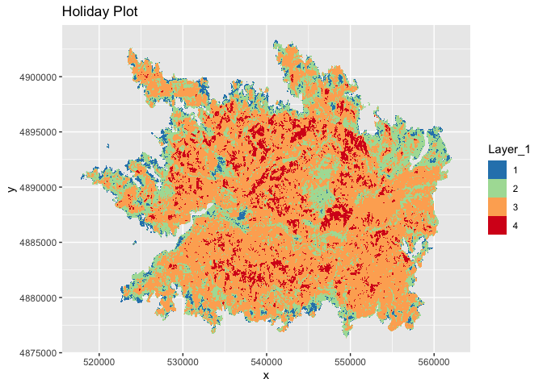

Lab 5 Oregon Fires
================
Lauren Ponisio

## Conservation/ecology Topics

> - Explore how Oregon fires are changing due to fire suppression and
>   climate change.
> - Describe fundamental concepts in fire ecology, including fire
>   severity.

# Statistical Topics

> - Describe the fundamental attributes of a raster dataset.

# Computational Topics

> - Explore raster attributes and metadata using R.
> - Import rasters into R using the `terra` package.
> - Plot raster files in R using the `ggplot2` package.
> - Reproject raster and vector data
> - Layer raster and vector data together

# Lab part 1: reading in fire raster data and plotting

We will be working with the soil burn severity data from the 2020
Holiday Farm Fire (up the McKenzie E of Eugene), the 2020 Beachie Fire
(near Portland) and the 2018 Terwilliger fire (up the McKenzie E of
Eugene, near Cougar hotsprings).

We will use data downloaded from the USGS:
<https://burnseverity.cr.usgs.gov/products/baer>

Specifically, BARC Fire Severity layers are created by first calculating
spectral indices from pre- and post-fire satellite imagery that are
sensitive to changes caused by fire. The two images are then subtracted
showing the difference between them which is then binned into 4 burn
severity classes (high, moderate, low, very low/unburned). Field crews
ground-truth the severity classes.

The metadata files provide additional details on how the continuous data
was binned into discrete categories.

1.  Read in each fire severity rasters, name them \[fire name\]\_rast.
    The .tif files are the rasters.

HINT: The files are nested within folders so be aware of your file
paths.

``` r
holiday_farm_rast = rast("soil-burn-severity/2020_holidayfarm_sbs/HolidayFarm_SBS_final.tif")
beachie_rast = rast("soil-burn-severity/2020_beachiecreek_sbs/BeachieCreek_SBS_final.tif")
terwilliger_rast = rast("soil-burn-severity/2018_terwilliger_sbs/SoilSeverity.tif")
```

2.  Summarize the values of the rasters. Take note of the labels
    associated with the data values because you will need it for
    plotting.

``` r
holiday_df = as.data.frame(holiday_farm_rast, xy = TRUE)
beachie_df = as.data.frame(beachie_rast, xy = TRUE)
terwilliger_df = as.data.frame(terwilliger_rast, xy = TRUE)

str(holiday_df)
```

    ## 'data.frame':    1750770 obs. of  3 variables:
    ##  $ x      : num  541078 541098 541118 541138 541158 ...
    ##  $ y      : num  4903324 4903324 4903324 4903324 4903324 ...
    ##  $ Layer_1: Factor w/ 127 levels "0","1","2","3",..: 2 2 2 2 2 2 2 2 2 2 ...

``` r
str(beachie_df)
```

    ## 'data.frame':    1948877 obs. of  3 variables:
    ##  $ x      : num  395819 395839 395859 395879 395899 ...
    ##  $ y      : num  1221232 1221232 1221232 1221232 1221232 ...
    ##  $ Layer_1: Factor w/ 127 levels "0","1","2","3",..: 3 3 3 3 3 3 3 3 3 3 ...

``` r
str(terwilliger_df)
```

    ## 'data.frame':    51544 obs. of  3 variables:
    ##  $ x         : num  419860 419890 419920 419950 420340 ...
    ##  $ y         : num  1119923 1119923 1119923 1119923 1119923 ...
    ##  $ SoilBurnSe: Factor w/ 4 levels "Unburned","Low",..: 1 2 1 2 2 2 1 2 1 1 ...

3.  Plot each raster.. Set the scale to be
    `scale_fill_brewer(palette = "Spectral", direction=-1)`

HINT: Remember we have to turn them into “data.frames” for ggplot to
recognize them as plot-able.

HINT HINT: Remember to check the labels of the data values to be able to
set the fill.

``` r
ggplot() +
    geom_raster(data = holiday_df , aes(x = x, y = y, fill = Layer_1)) +
    labs(title = "Holiday Plot") +
    scale_fill_brewer(palette = "Spectral", direction=-1)
```

    ## Warning: Raster pixels are placed at uneven horizontal intervals and will be shifted
    ## ℹ Consider using `geom_tile()` instead.

<figure>

<figcaption aria-hidden="true">Holiday plot with ggplot2 using the
Spectral color scale</figcaption>
</figure>

``` r
ggplot() +
    geom_raster(data = beachie_df , aes(x = x, y = y, fill = Layer_1)) +
    scale_fill_brewer(palette = "Spectral", direction=-1) +
  labs(title = "Beachie Plot")
```

    ## Warning: Raster pixels are placed at uneven horizontal intervals and will be shifted
    ## ℹ Consider using `geom_tile()` instead.

<figure>

<figcaption aria-hidden="true">Beachie plot with ggplot2 using the
Spectral color scale</figcaption>
</figure>

``` r
ggplot() +
    geom_raster(data = terwilliger_df , aes(x = x, y = y, fill = SoilBurnSe)) +
  scale_fill_brewer(palette = "Spectral", direction=-1) +
  labs(title = "Terwilliger Plot")
```

<figure>

<figcaption aria-hidden="true">Terwilliger plot with ggplot2 using the
Spectral color scale</figcaption>
</figure>

4.  Compare these visualizations what is something you notice? -ANSWER:
    Beachie and Holiday are more contained within one area and the
    Terwilliger fire is spread in three distinct areas.

# Lab part 2: Exploring the attributes of our spatial data.

1.  What are the crs of the rasters? What are the units? Are they all
    the same?

``` r
crs(holiday_farm_rast, proj = TRUE)
```

    ## [1] "+proj=utm +zone=10 +datum=NAD83 +units=m +no_defs"

``` r
crs(beachie_rast, proj = TRUE)
```

    ## [1] "+proj=aea +lat_0=34 +lon_0=-120 +lat_1=43 +lat_2=48 +x_0=600000 +y_0=0 +datum=NAD83 +units=m +no_defs"

``` r
crs(terwilliger_rast, proj = TRUE)
```

    ## [1] "+proj=aea +lat_0=34 +lon_0=-120 +lat_1=43 +lat_2=48 +x_0=600000 +y_0=0 +datum=NAD83 +units=m +no_defs"

- ANSWER crs: Holiday: utm +zone=10 +datum=NAD83, Beachie & Terwilliger:
  aea +lat_0=34 +lon_0=-120 +lat_1=43 +lat_2=48 +x_0=600000 +y_0=0
  +datum=NAD83

- ANSWER units: Holiday, Beachie, Terwilliger are all in meters

- ANSWER the same? CRS - Holiday is unique, other two are same The same?
  All are in meters

2.  What about the resolution of each raster?

``` r
res(holiday_farm_rast)
```

    ## [1] 20 20

``` r
res(beachie_rast)
```

    ## [1] 20 20

``` r
res(terwilliger_rast)
```

    ## [1] 30 30

- ANSWER resolution: For holiday and beachie it is 20/20, but for
  terwilliger it is 30/30
- ANSWER the same? : The same? First two are the same

3.  Calculate the min and max values of each raster. Are they all the
    same?

``` r
minmax(holiday_farm_rast)
```

    ##     Layer_1
    ## min       1
    ## max     127

``` r
minmax(beachie_rast)
```

    ##     Layer_1
    ## min       1
    ## max     127

``` r
minmax(terwilliger_rast)
```

    ##     SoilBurnSe
    ## min          1
    ## max          4

- ANSWER minmax: For Holiday and Beachie, we have (min, max) = (1, 127),
  but for Terwilliger it is (1, 4)

Given we expect there to be 4 values for each bin of severity (high,
moderate, low, very low/unburned), let’s try to work out why there are
values other than 1-4. After checking the metadata .txt and inspecting
the metadata in the raster itself, I could not find an explicit mention
of the meaning on the non 1-4 data (maybe you can?). Not great practices
USGS! But it is likely missing data. Let’s convert the Holiday data
greater than 4 to NA, just like we would a regular matrix of data.

``` r
holiday_farm_rast[holiday_farm_rast > 4] <- NA
summary(values(holiday_farm_rast))
```

    ##     Layer_1       
    ##  Min.   :1.0      
    ##  1st Qu.:2.0      
    ##  Median :3.0      
    ##  Mean   :2.8      
    ##  3rd Qu.:3.0      
    ##  Max.   :4.0      
    ##  NA's   :1536190

That’s better :)

4.  Do the same conversion for Beachie.

``` r
beachie_rast[beachie_rast > 4] <- NA
summary(values(beachie_rast))
```

    ##     Layer_1       
    ##  Min.   :1.0      
    ##  1st Qu.:2.0      
    ##  Median :3.0      
    ##  Mean   :2.7      
    ##  3rd Qu.:3.0      
    ##  Max.   :4.0      
    ##  NA's   :2437627

# Lab part 3: Reprojection

From our exploration above, the rasters are not in the same projection,
so we will need to re-project them if we are going to be able to plot
them together.

We can use the `project()` function to reproject a raster into a new
CRS. The syntax is `project(RasterObject, crs)`

1.  First we will reproject our `beachie_rast` raster data to match the
    `holidat_rast` CRS. If the resolution is different, change it to
    match Holiday’s resolution.

Don’t change the name from beachie_rast.

``` r
beachie_rast <- project(beachie_rast, crs(holiday_farm_rast))
# This should return TRUE
crs(beachie_rast, proj = TRUE) == crs(holiday_farm_rast, proj = TRUE)
```

    ## [1] TRUE

2.  Now convert the Terwilliger crs to the holiday crs. If the
    resolution is different, change it to match Holiday’s resolution.

``` r
terwilliger_rast <- project(terwilliger_rast, crs(holiday_farm_rast), res = res(holiday_farm_rast))
# This should return TRUE TRUE
crs(terwilliger_rast, proj = TRUE) == crs(holiday_farm_rast, proj = TRUE)
```

    ## [1] TRUE

``` r
res(terwilliger_rast)[2] == res(holiday_farm_rast)[2]
```

    ## [1] TRUE

3.  Now you can plot all of the fires on the same map! HINT: Remember to
    re-make the dataframes.

``` r
holiday_df <- as.data.frame(holiday_farm_rast, xy=TRUE)
beachie_df <- as.data.frame(beachie_rast, xy=TRUE)
terwilliger_df <- as.data.frame(terwilliger_rast, xy=TRUE)

ggplot() +
  geom_raster(data = terwilliger_df, aes(x = x, y = y, fill = SoilBurnSe)) +
  geom_raster(data = holiday_df, aes(x = x, y = y, fill = Layer_1), alpha = 0.5) +  
  geom_raster(data = beachie_df, aes(x = x, y = y, fill = Layer_1), alpha = 0.5) +
  scale_fill_brewer(palette = "Spectral", direction = -1) +
  labs(title = "Fire Plot: Terwilliger, Holiday Farm, and Beachie Fires")
```

    ## Warning: Raster pixels are placed at uneven horizontal intervals and will be shifted
    ## ℹ Consider using `geom_tile()` instead.
    ## Raster pixels are placed at uneven horizontal intervals and will be shifted
    ## ℹ Consider using `geom_tile()` instead.

<!-- -->

Well that’s annoying. It appears as though in 2018 the makers of these
data decided to give 1,2,3,4 categorical names which are being
interpreted as two different scales. If we look at the terwilliger_rast
values we can see that in min max.

``` r
terwilliger_rast$SoilBurnSe
```

    ## class       : SpatRaster 
    ## dimensions  : 776, 417, 1  (nrow, ncol, nlyr)
    ## resolution  : 20, 20  (x, y)
    ## extent      : 558901, 567241, 4870585, 4886105  (xmin, xmax, ymin, ymax)
    ## coord. ref. : NAD83 / UTM zone 10N (EPSG:26910) 
    ## source(s)   : memory
    ## categories  : SoilBurnSe, BAER_Acres 
    ## name        : SoilBurnSe 
    ## min value   :   Unburned 
    ## max value   :       High

4.  Let’s deal with the the easy way and modify the dataframe. Convert
    High to 4, Moderate to 3, Low to 2, and Unburned to 1 using your
    data subsetting skills.

Somethings you will need to be careful of: - If you check the class of
terwilliger_rast_df\$SoilBurnSe it is a factor, which is a special class
of data that are ordered categories with specific levels. R will not let
you convert add a level. So first, convert the data to characters (using
as.character()). - Now the data are characters, so you will not be able
to add in numerics. So code the 1,2,3 as characters i.e., “1”, “2”… - We
will eventually want the data to be factors again so it will match up
with the other rasters. So lastly, convert the data to a factor (using
as.factor()).

``` r
terwilliger_df$SoilBurnSe <- as.character(terwilliger_df$SoilBurnSe)

terwilliger_df$SoilBurnSe[terwilliger_df$SoilBurnSe == "Unburned"] <- "1"
terwilliger_df$SoilBurnSe[terwilliger_df$SoilBurnSe == "Low"] <- "2"
terwilliger_df$SoilBurnSe[terwilliger_df$SoilBurnSe == "Moderate"] <- "3"
terwilliger_df$SoilBurnSe[terwilliger_df$SoilBurnSe == "High"] <- "4"

terwilliger_df$SoilBurnSe <- as.factor(terwilliger_df$SoilBurnSe)
```

5.  Try plotting again.

``` r
ggplot() +
  geom_raster(data = terwilliger_df, aes(x = x, y = y, fill = SoilBurnSe)) +
  geom_raster(data = holiday_df, aes(x = x, y = y, fill = Layer_1), alpha = 0.5) +  
  geom_raster(data = beachie_df, aes(x = x, y = y, fill = Layer_1), alpha = 0.5) +
  scale_fill_brewer(palette = "Spectral", direction = -1) +
  labs(title = "Fire Plot: Terwilliger, Holiday Farm, and Beachie Fires")
```

    ## Warning: Raster pixels are placed at uneven horizontal intervals and will be shifted
    ## ℹ Consider using `geom_tile()` instead.
    ## Raster pixels are placed at uneven horizontal intervals and will be shifted
    ## ℹ Consider using `geom_tile()` instead.

<!-- -->
The scale bar make sense! It would be nice to have a baselayer map to
see where is Oregon these fires are.

# Lab part 4: Adding in vector data

I found a nice ecoregion map on the OR spatial data website.
<https://spatialdata.oregonexplorer.info/geoportal/details;id=3c7862c4ae664993ad1531907b1e413e>

1.  Load the data into R, it is in the OR-ecoregions folder.

``` r
eco_map <- st_read("OR-ecoregions/Ecoregions_OregonConservationStrategy.shp")
```

    ## Reading layer `Ecoregions_OregonConservationStrategy' from data source 
    ##   `/Users/madikloberdanz/Documents/BI410/labs/5-OR-fires/OR-ecoregions/Ecoregions_OregonConservationStrategy.shp' 
    ##   using driver `ESRI Shapefile'
    ## Simple feature collection with 9 features and 6 fields
    ## Geometry type: POLYGON
    ## Dimension:     XY
    ## Bounding box:  xmin: 183871.7 ymin: 88600.88 xmax: 2345213 ymax: 1675043
    ## Projected CRS: NAD83 / Oregon GIC Lambert (ft)

2.  Check the projection and re-project if needed. We did not cover this
    in the lecture demo, but for vector data, use st_transform()

``` r
eco_map <- st_transform(eco_map, crs(beachie_rast))
crs(eco_map, proj=TRUE) # Both in UTM now
```

    ## [1] "+proj=utm +zone=10 +datum=NAD83 +units=m +no_defs"

3.  Plot all of the data together (the rasters and vector data). You can
    layer on geom_sf into ggplot with the other rasters just like you
    would add another raster.

``` r
eco_map <- as.data.frame(eco_map)
ggplot() +
  geom_raster(data = terwilliger_df, aes(x = x, y = y, fill = SoilBurnSe)) +
  geom_raster(data = holiday_df, aes(x = x, y = y, fill = Layer_1), alpha = 0.5) +  
  geom_raster(data = beachie_df, aes(x = x, y = y, fill = Layer_1), alpha = 0.5) +
  geom_sf(data = eco_map, aes(geometry = geometry), color = "black", alpha = 0.3) +
  scale_fill_brewer(palette = "Spectral", direction = -1) +
  labs(title = "Fire Plot: Terwilliger, Holiday Farm, and Beachie Fires")
```

    ## Warning: Raster pixels are placed at uneven horizontal intervals and will be shifted
    ## ℹ Consider using `geom_tile()` instead.
    ## Raster pixels are placed at uneven horizontal intervals and will be shifted
    ## ℹ Consider using `geom_tile()` instead.

<!-- -->
We could get fancy and zoom into the correct region using extent, which
we will cover next week. For now, this looks pretty good.

# Lab part 5: Exploring patterns of fire severity

1.  Create a barplot with the count of each fire severity category.

- Use scale_fill_brewer(palette = “Spectral”, direction=-1) to get the
  bars to match the maps.
- Plot the proportion on the y. To do this, in geom_bar, include y =
  (..count..)/sum(..count..). EX: aes(x= Layer_1, y =
  (..count..)/sum(..count..)

HINT: Rather annoyingly, you will need to convert the layer values to
factors again to get fill to recognize them. EX: fill=as.factor(Layer_1)

``` r
# Combine burn severity data into a single data frame
severity_data <- rbind(
  data.frame(Severity = terwilliger_df$SoilBurnSe, Source = "Terwilliger"),
  data.frame(Severity = holiday_df$Layer_1, Source = "Holiday Farm"),
  data.frame(Severity = beachie_df$Layer_1, Source = "Beachie")
)

# Convert Severity levels to factors
severity_data$Severity <- as.factor(severity_data$Severity)

# Create the bar plot with proportions
ggplot(severity_data, aes(x = Severity, y = (..count..) / sum(..count..), fill = Severity)) +
  geom_bar() +
  scale_fill_brewer(palette = "Spectral", direction = -1) +
  labs(title = "Proportion of Fire Severity Categories",
       x = "Fire Severity",
       y = "Proportion")
```

    ## Warning: The dot-dot notation (`..count..`) was deprecated in ggplot2 3.4.0.
    ## ℹ Please use `after_stat(count)` instead.
    ## This warning is displayed once every 8 hours.
    ## Call `lifecycle::last_lifecycle_warnings()` to see where this warning was
    ## generated.

<!-- --> b. What do you
notice about the frequency of different severity classes when you
compare these barplots. How does this relate to the Haldofsky reading?
ANSWER: A severity of 3 is the most common, making up over 50% of the
fires. This relates to the reading because we are seeing more 3 and 4
severity fires (about 65% total) compared to about 35% level 1 and 2
fires. This is evidence that fires are being fueled by climate change,
with higher temperatures leading to more severe fires.

Also, if the legend label bothers you (as it does for me) Check out this
tutorial:
<https://www.datanovia.com/en/blog/ggplot-legend-title-position-and-labels/>
