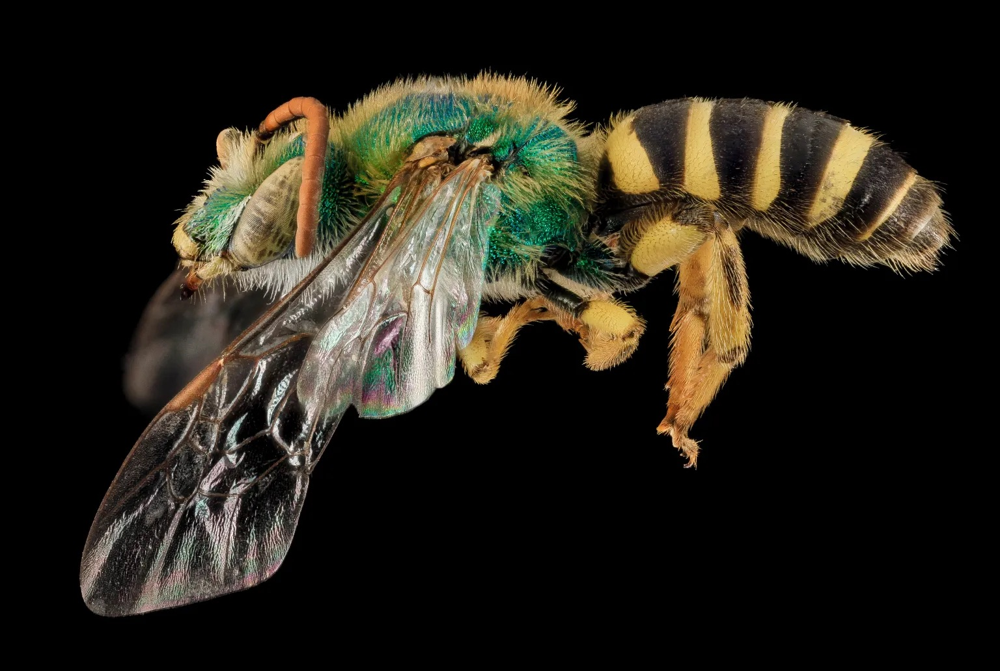
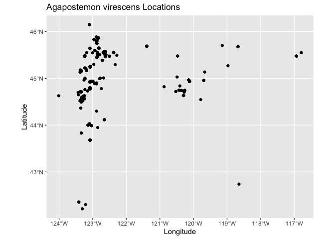
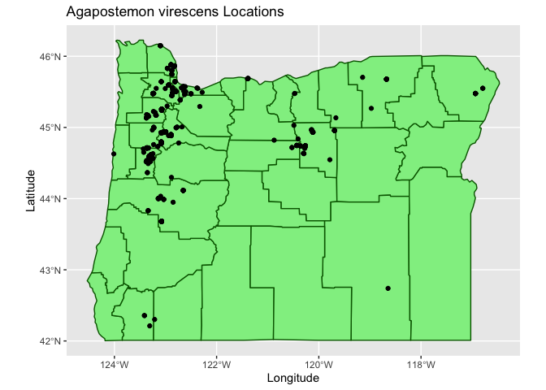
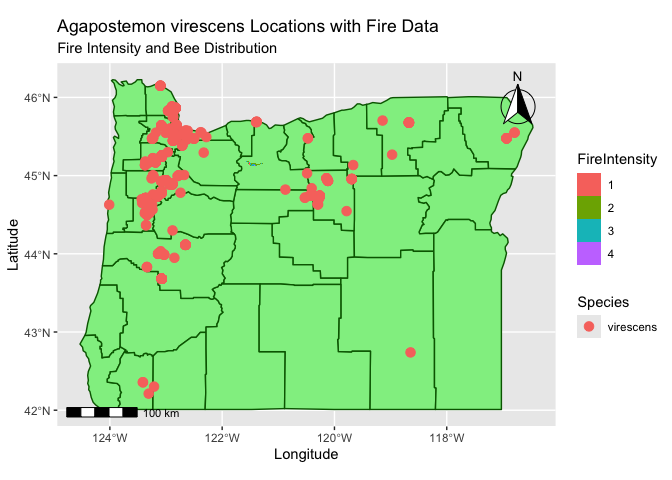
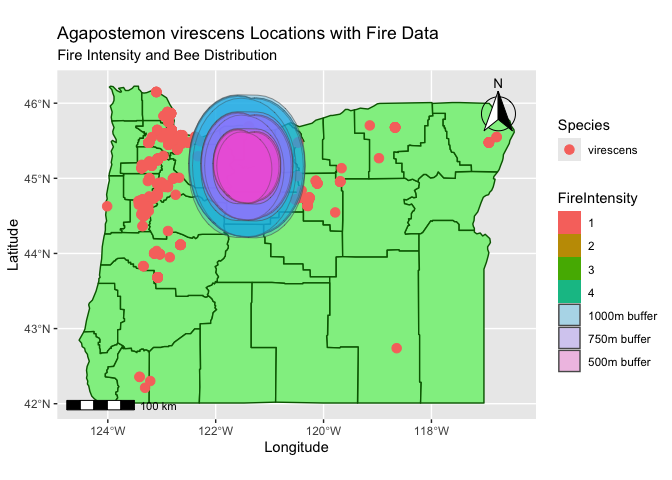
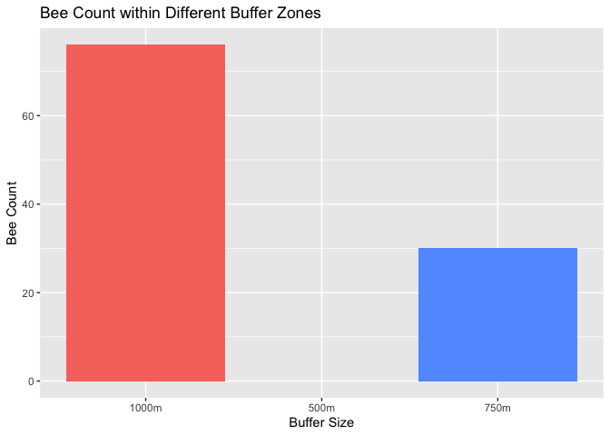

Exploring bee-related spatial data
================
Lauren Ponisio

<!-- Lesson Overview -->

# Conservation/ecology Topics

> - Species distributions

# Computational Topics

> - Convert a data frame to a spatial object.
> - Plot multiple spatial layers.

------------------------------------------------------------------------

# Lab part 1: Oregon bee atlas data exploration

1.  Import the OBA data.

``` r
oba_df <- read.csv("OBA_2018-2023.csv")
str(oba_df)
```

    ## 'data.frame':    195788 obs. of  67 variables:
    ##  $ Observation.No.                    : chr  "Andony_Melathopoulos:18.001.001" "Andony_Melathopoulos:18.002.001" "Andony_Melathopoulos:18.002.002" "Andony_Melathopoulos:18.002.003" ...
    ##  $ Voucher.No.                        : chr  "" "" "" "" ...
    ##  $ user_id                            : int  429964 429964 429964 429964 429964 429964 429964 429964 429964 429964 ...
    ##  $ user_login                         : chr  "amelathopoulos" "amelathopoulos" "amelathopoulos" "amelathopoulos" ...
    ##  $ Collector...First.Name             : chr  "Andony" "Andony" "Andony" "Andony" ...
    ##  $ Collector...First.Initial          : chr  "A." "A." "A." "A." ...
    ##  $ Collector...Last.Name              : chr  "Melathopoulos" "Melathopoulos" "Melathopoulos" "Melathopoulos" ...
    ##  $ Collectors                         : chr  "A.Melathopoulos" "A.Melathopoulos" "A.Melathopoulos" "A.Melathopoulos" ...
    ##  $ taxon_kingdom_name                 : chr  "" "" "" "" ...
    ##  $ Associated.plant...genus..species  : chr  "" "" "" "" ...
    ##  $ url                                : chr  "" "" "" "" ...
    ##  $ Sample.ID                          : chr  "" "" "" "" ...
    ##  $ Specimen.ID                        : int  NA NA NA NA NA NA NA NA NA NA ...
    ##  $ Collection.Day.1                   : chr  "18" "20" "20" "20" ...
    ##  $ Month.1                            : chr  "iii" "iii" "iii" "iii" ...
    ##  $ MonthJul                           : chr  "March" "March" "March" "March" ...
    ##  $ MonthAb                            : int  3 3 3 3 9 9 9 9 3 3 ...
    ##  $ Year.1                             : int  2018 2018 2018 2018 2018 2018 2018 2018 2018 2018 ...
    ##  $ Collection.Date                    : chr  "3/18/2018" "3/20/2018" "3/20/2018" "3/20/2018" ...
    ##  $ Time.1                             : chr  "" "" "" "" ...
    ##  $ Collection.Day.2                   : chr  "" "" "" "" ...
    ##  $ Month.2                            : chr  "" "" "" "" ...
    ##  $ Year.2                             : chr  "" "" "" "" ...
    ##  $ Collection.Day.2.Merge             : chr  "" "" "" "" ...
    ##  $ Time.2                             : chr  "" "" "" "" ...
    ##  $ Collection.ID                      : chr  "A Melathopoulos " "A Melathopoulos" "A Melathopoulos" "A Melathopoulos" ...
    ##  $ Position.of.1st.digit              : chr  "" "" "" "" ...
    ##  $ Collection.No.                     : chr  "1" "2" "2" "2" ...
    ##  $ Sample.No.                         : int  1 1 2 3 4 5 6 7 1 1 ...
    ##  $ Country                            : chr  "USA" "USA" "USA" "USA" ...
    ##  $ State                              : chr  "Oregon" "Oregon" "Oregon" "Oregon" ...
    ##  $ County                             : chr  "Benton" "Benton" "Benton" "Benton" ...
    ##  $ Location                           : chr  "Corvallis, NW Orchard Ave" "Corvallis, NW Orchard Ave" "Corvallis, NW Orchard Ave" "Corvallis, NW Orchard Ave" ...
    ##  $ Abbreviated.Location               : chr  "Astoria Maggie Johnson Rd" "Big Crk. Mainline Knob Pt Rd" "Big Crk. Mainline Knob Pt Rd" "Big Crk. Mainline Knob Pt Rd" ...
    ##  $ Collection.Site.Description        : chr  "" "" "" "" ...
    ##  $ Team                               : chr  "Melathopoulos" "Melathopoulos" "Melathopoulos" "Melathopoulos" ...
    ##  $ Habitat                            : chr  "" "" "" "" ...
    ##  $ Elevation..m.                      : chr  "" "" "" "" ...
    ##  $ Dec..Lat.                          : num  44.6 44.6 44.6 44.6 46.1 ...
    ##  $ Dec..Long.                         : num  -123 -123 -123 -123 -124 ...
    ##  $ X                                  : int  NA NA NA NA NA NA NA NA NA NA ...
    ##  $ Collectionmethod                   : chr  "Net" "Net" "Net" "Net" ...
    ##  $ Collection.method.merge.field      : chr  "" "" "" "" ...
    ##  $ Associated.plant...family          : chr  "" "" "" "" ...
    ##  $ Associated.plant...genus..species.1: chr  "" "" "" "" ...
    ##  $ Associated.plant...Inaturalist.URL : chr  "" "" "" "" ...
    ##  $ Associated.plant                   : chr  "" "" "" "" ...
    ##  $ Assoc.plant.merge.field            : chr  "" "" "" "" ...
    ##  $ Collectors.1                       : chr  "Andony Melathopoulos" "Andony Melathopoulos" "Andony Melathopoulos" "Andony Melathopoulos" ...
    ##  $ Collector.1.abreviation            : chr  "A Melathopoulos " "A Melathopoulos" "A Melathopoulos" "A Melathopoulos" ...
    ##  $ Collector.2                        : logi  NA NA NA NA NA NA ...
    ##  $ Collector.3                        : logi  NA NA NA NA NA NA ...
    ##  $ Genus                              : chr  "" "" "" "" ...
    ##  $ Species                            : chr  "" "" "" "" ...
    ##  $ sex                                : chr  "" "" "" "" ...
    ##  $ caste                              : chr  "" "" "" "" ...
    ##  $ vol.det.Genus                      : chr  "" "" "" "" ...
    ##  $ vol.det.Species                    : chr  "" "" "" "" ...
    ##  $ vol.det.sex.caste                  : chr  "" "" "" "" ...
    ##  $ Determined.By                      : chr  "" "" "" "" ...
    ##  $ Date.Determined                    : logi  NA NA NA NA NA NA ...
    ##  $ Verified.By                        : logi  NA NA NA NA NA NA ...
    ##  $ Other.Determiner.s.                : chr  "" "" "" "" ...
    ##  $ Other.Dets.Sci..Name.s.            : logi  NA NA NA NA NA NA ...
    ##  $ Other.Dets..Date.s.                : logi  NA NA NA NA NA NA ...
    ##  $ Additional.Notes                   : chr  "" "" "" "" ...
    ##  $ X.1                                : logi  NA NA NA NA NA NA ...

2.  Find the columns related to genus and species and paste them
    together (with a space between) using the function paste(). Name the
    new column GenusSpecies.

``` r
oba_df$GenusSpecies <- paste(oba_df$Genus, oba_df$Species, sep = " ")
```

3.  Use `sort()` and `unique()` to print the unique values of
    GenusSpecies in alphabetical order. How many species are there?

``` r
unique_genus_specs <- sort(unique(oba_df$GenusSpecies))
length(unique_genus_specs)
```

    ## [1] 539

Some specimens are not identified to species, only genus. How is this
reflected in the data? In two weeks we will learn how to clean this up
using regular expressions.

It looks like we sometimes see it denoted like this: “Andrena” “Andrena”
“Andrena angustitarsata”  
“Andrena astragali” “Andrena chlorogaster” “Andrena crataegi”

4.  So many bees, so little time. Count up the occurrences of each bee
    species, and subset the data to bees that have been seen at least
    two times. You can use the tidyverse or any other functions in R
    that you like. How many “species” are there?

``` r
species_counts <- oba_df %>%
  group_by(Species) %>%        
  summarize(count = n()) %>%
  filter(count >= 2)

nrow(species_counts)
```

    ## [1] 346

``` r
oba_df <- oba_df %>% filter(Species %in% species_counts$Species)
head(oba_df)
```

    ##                   Observation.No. Voucher.No. user_id     user_login
    ## 1 Andony_Melathopoulos:18.001.001              429964 amelathopoulos
    ## 2 Andony_Melathopoulos:18.002.001              429964 amelathopoulos
    ## 3 Andony_Melathopoulos:18.002.002              429964 amelathopoulos
    ## 4 Andony_Melathopoulos:18.002.003              429964 amelathopoulos
    ## 5 Andony_Melathopoulos:18.002.004              429964 amelathopoulos
    ## 6 Andony_Melathopoulos:18.002.005              429964 amelathopoulos
    ##   Collector...First.Name Collector...First.Initial Collector...Last.Name
    ## 1                 Andony                        A.         Melathopoulos
    ## 2                 Andony                        A.         Melathopoulos
    ## 3                 Andony                        A.         Melathopoulos
    ## 4                 Andony                        A.         Melathopoulos
    ## 5                 Andony                        A.         Melathopoulos
    ## 6                 Andony                        A.         Melathopoulos
    ##        Collectors taxon_kingdom_name Associated.plant...genus..species url
    ## 1 A.Melathopoulos                                                         
    ## 2 A.Melathopoulos                                                         
    ## 3 A.Melathopoulos                                                         
    ## 4 A.Melathopoulos                                                         
    ## 5 A.Melathopoulos                                                         
    ## 6 A.Melathopoulos                                                         
    ##   Sample.ID Specimen.ID Collection.Day.1 Month.1  MonthJul MonthAb Year.1
    ## 1                    NA               18     iii     March       3   2018
    ## 2                    NA               20     iii     March       3   2018
    ## 3                    NA               20     iii     March       3   2018
    ## 4                    NA               20     iii     March       3   2018
    ## 5                    NA                2      ix September       9   2018
    ## 6                    NA                2      ix September       9   2018
    ##   Collection.Date Time.1 Collection.Day.2 Month.2 Year.2 Collection.Day.2.Merge
    ## 1       3/18/2018                                                              
    ## 2       3/20/2018                                                              
    ## 3       3/20/2018                                                              
    ## 4       3/20/2018                                                              
    ## 5        9/2/2018                                                              
    ## 6        9/2/2018                                                              
    ##   Time.2    Collection.ID Position.of.1st.digit Collection.No. Sample.No.
    ## 1        A Melathopoulos                                     1          1
    ## 2         A Melathopoulos                                    2          1
    ## 3         A Melathopoulos                                    2          2
    ## 4         A Melathopoulos                                    2          3
    ## 5         A Melathopoulos                                    2          4
    ## 6         A Melathopoulos                                    2          5
    ##   Country  State  County                                        Location
    ## 1     USA Oregon  Benton                       Corvallis, NW Orchard Ave
    ## 2     USA Oregon  Benton                       Corvallis, NW Orchard Ave
    ## 3     USA Oregon  Benton                       Corvallis, NW Orchard Ave
    ## 4     USA Oregon  Benton                       Corvallis, NW Orchard Ave
    ## 5     USA Oregon Clatsop Clatskanie, Big Creek Mainline, Knob Point Road
    ## 6     USA Oregon Clatsop Clatskanie, Big Creek Mainline, Knob Point Road
    ##           Abbreviated.Location Collection.Site.Description          Team
    ## 1    Astoria Maggie Johnson Rd                             Melathopoulos
    ## 2 Big Crk. Mainline Knob Pt Rd                             Melathopoulos
    ## 3 Big Crk. Mainline Knob Pt Rd                             Melathopoulos
    ## 4 Big Crk. Mainline Knob Pt Rd                             Melathopoulos
    ## 5 Big Crk. Mainline Knob Pt Rd                             Melathopoulos
    ## 6 Big Crk. Mainline Knob Pt Rd                             Melathopoulos
    ##   Habitat Elevation..m. Dec..Lat. Dec..Long.  X Collectionmethod
    ## 1                          44.556   -123.285 NA              Net
    ## 2                          44.567   -123.283 NA              Net
    ## 3                          44.567   -123.283 NA              Net
    ## 4                          44.567   -123.283 NA              Net
    ## 5                          46.102   -123.506 NA              Net
    ## 6                          46.102   -123.506 NA              Net
    ##   Collection.method.merge.field Associated.plant...family
    ## 1                                                        
    ## 2                                                        
    ## 3                                                        
    ## 4                                                        
    ## 5                                                        
    ## 6                                                        
    ##   Associated.plant...genus..species.1 Associated.plant...Inaturalist.URL
    ## 1                                                                       
    ## 2                                                                       
    ## 3                                                                       
    ## 4                                                                       
    ## 5                                                                       
    ## 6                                                                       
    ##   Associated.plant Assoc.plant.merge.field          Collectors.1
    ## 1                                           Andony Melathopoulos
    ## 2                                           Andony Melathopoulos
    ## 3                                           Andony Melathopoulos
    ## 4                                           Andony Melathopoulos
    ## 5                                          Andony Melathopoulos 
    ## 6                                          Andony Melathopoulos 
    ##   Collector.1.abreviation Collector.2 Collector.3 Genus Species sex caste
    ## 1        A Melathopoulos           NA          NA                        
    ## 2         A Melathopoulos          NA          NA                        
    ## 3         A Melathopoulos          NA          NA                        
    ## 4         A Melathopoulos          NA          NA                        
    ## 5         A Melathopoulos          NA          NA                        
    ## 6         A Melathopoulos          NA          NA                        
    ##   vol.det.Genus vol.det.Species vol.det.sex.caste Determined.By Date.Determined
    ## 1                                                                            NA
    ## 2                                                                            NA
    ## 3                                                                            NA
    ## 4                                                                            NA
    ## 5                                                                            NA
    ## 6                                                                            NA
    ##   Verified.By Other.Determiner.s. Other.Dets.Sci..Name.s. Other.Dets..Date.s.
    ## 1          NA                                          NA                  NA
    ## 2          NA                                          NA                  NA
    ## 3          NA                                          NA                  NA
    ## 4          NA                                          NA                  NA
    ## 5          NA                                          NA                  NA
    ## 6          NA                                          NA                  NA
    ##   Additional.Notes X.1 GenusSpecies
    ## 1                   NA             
    ## 2                   NA             
    ## 3                   NA             
    ## 4                   NA             
    ## 5                   NA             
    ## 6                   NA

5.  Google a few bee names (that have been seen \> 2 times) and find one
    with an a look that resonates with you.

What is the name of your bee? Agapostemon virescens

Import the photos into Rmarkdown below (hint: googling bee name
“discover life” or “inat” can often get you a photo. Many bees will no
have any photos :(

<figure>

<figcaption aria-hidden="true">Agapostemon virescens bee</figcaption>
</figure>

# Lab part 2: Plotting the distrubution of your spirit bee.

How that have chosen your spirit bee, we would like to plot it’s
distribution. What is the crs of the data? Annoyingly it is not
described anywhere in the spreadsheet (always list your crs in your
data) but it is the same as what inat uses because all bees have a
georeferenced plant host. If the data is in lat long, it is
“unprojected” so only a datum will be listed. DATUM: WGS84, unprojected
lat long. EPSG code: 4326.

``` r
crs("EPSG:4326")
```

    ## [1] "GEOGCRS[\"WGS 84\",\n    ENSEMBLE[\"World Geodetic System 1984 ensemble\",\n        MEMBER[\"World Geodetic System 1984 (Transit)\"],\n        MEMBER[\"World Geodetic System 1984 (G730)\"],\n        MEMBER[\"World Geodetic System 1984 (G873)\"],\n        MEMBER[\"World Geodetic System 1984 (G1150)\"],\n        MEMBER[\"World Geodetic System 1984 (G1674)\"],\n        MEMBER[\"World Geodetic System 1984 (G1762)\"],\n        MEMBER[\"World Geodetic System 1984 (G2139)\"],\n        ELLIPSOID[\"WGS 84\",6378137,298.257223563,\n            LENGTHUNIT[\"metre\",1]],\n        ENSEMBLEACCURACY[2.0]],\n    PRIMEM[\"Greenwich\",0,\n        ANGLEUNIT[\"degree\",0.0174532925199433]],\n    CS[ellipsoidal,2],\n        AXIS[\"geodetic latitude (Lat)\",north,\n            ORDER[1],\n            ANGLEUNIT[\"degree\",0.0174532925199433]],\n        AXIS[\"geodetic longitude (Lon)\",east,\n            ORDER[2],\n            ANGLEUNIT[\"degree\",0.0174532925199433]],\n    USAGE[\n        SCOPE[\"Horizontal component of 3D system.\"],\n        AREA[\"World.\"],\n        BBOX[-90,-180,90,180]],\n    ID[\"EPSG\",4326]]"

1.  Extract the X and Y locations for your species only from the data
    and create a spatial object. Don’t forget to set the CRS! Hint 1:
    consider what other data you would like to keep as attributes, for
    example what flower they were foraging on. Hint 2: Remember the lat
    is y and long is x. Hint 3: You may want to rename the column names
    you can use, colnames() and reassign the names, since the ones in
    the oba data spreadsheet are really ugly.

``` r
# Get the data for just this bee
selected_bee <- oba_df %>% filter(GenusSpecies == "Agapostemon virescens")

# Grab the Lat and Lon from this bee's data, along with other fields we might want
bees_lat_long <- selected_bee %>% 
  select(Dec..Lat., Dec..Long., Genus, Species, Associated.plant)

bees_lat_long <- bees_lat_long %>% 
    rename(Latitude = Dec..Lat., Longitude = Dec..Long., Plant = Associated.plant)

# Turn this into a spatial object with X = Long, Y = Lat
spatial_bee_locs <- st_as_sf(bees_lat_long, coords = c("Longitude", "Latitude"), crs = 4326)
spatial_bee_locs
```

    ## Simple feature collection with 507 features and 3 fields
    ## Geometry type: POINT
    ## Dimension:     XY
    ## Bounding box:  xmin: -124.012 ymin: 42.212 xmax: -116.792 ymax: 46.149
    ## Geodetic CRS:  WGS 84
    ## First 10 features:
    ##          Genus   Species Plant                geometry
    ## 1  Agapostemon virescens       POINT (-122.814 45.643)
    ## 2  Agapostemon virescens       POINT (-122.814 45.643)
    ## 3  Agapostemon virescens       POINT (-122.814 45.643)
    ## 4  Agapostemon virescens       POINT (-122.814 45.643)
    ## 5  Agapostemon virescens       POINT (-122.814 45.643)
    ## 6  Agapostemon virescens       POINT (-122.814 45.643)
    ## 7  Agapostemon virescens       POINT (-122.814 45.643)
    ## 8  Agapostemon virescens       POINT (-122.814 45.643)
    ## 9  Agapostemon virescens       POINT (-122.814 45.643)
    ## 10 Agapostemon virescens       POINT (-122.814 45.643)

2.  Plot your exciting bee data!

``` r
# Directly plot the spatial features
ggplot(spatial_bee_locs) +
  geom_sf() +
  labs(title = "Agapostemon virescens Locations", x = "Longitude", y = "Latitude")
```

<!-- -->

Not so exciting without some kind of background…

Luckily we can download basemaps into R using the map_data function in
ggplot (among many others). There is an example for retrieving the
Oregon county polygons.

``` r
or <- map_data("county", "oregon") %>%  
  select(lon = long, lat, group, id = subregion)
```

3.  Add your species’s points to your choice or an Oregon basemap.

``` r
library(ggspatial)

# Plot the polygon (oregon), then plot the spatial fetaures (bee locations) on top
ggplot(spatial_bee_locs) +
  geom_polygon(data = or, aes(x = lon, y = lat, group = group), fill = "lightgreen", color = "darkgreen") +
  geom_sf() +
  labs(title = "Agapostemon virescens Locations", x = "Longitude", y = "Latitude")
```

<!-- -->
\# Lab part 3: Cartography

1.  Here is your moment to explore your cartographic skills.

<!-- -->

1.  Add another spatial layer relevant to your final project and tweek
    the Oregon map in anyway that is useful/visually appealing. You may
    need to crop that layer to the extent of your species’s
    distribution.
2.  Color your points according to some data attribute and add a legend
    (month collected, county, collector, associated plant, whatever you
    think is interesting). You may need to circle back to 2.1 to save
    additional attributes when you converted the dataframe to a spatial
    object.
3.  Fine-tune your map: add a title, make sure the legend label makes
    sense, add a scale bar (google “add scale bar map ggplot” and choose
    your favorite package). All maps must always have a scale bar. You
    can add a N arrow as well, though some cartographers argue that is
    only necessary if N isn’t at the top of the map.
4.  Write a figure caption for your map explaining any interesting
    trends you see.
5.  Export you cropped layer to a .shp so you can use it again for your
    final project.
6.  Push this lab to your github repo (just the .Rmd, don’t push the
    data!)

``` r
### Part 1: Add another spatial layer (fire layer for my project)
  ## I will need to reproject the fire data to have the same CRS as the spatial bee data
  ## Then turn fire data into a dataframe
  ## I am then going to put the fire on the map with the bee data

fire_raster <- rast("whiteriver_sbs/WhiteRiver_SBS_final.tif")
fire_raster <- project(fire_raster, crs(spatial_bee_locs))

fire_df <- as.data.frame(fire_raster, xy = TRUE, na.rm = TRUE)
colnames(fire_df)[3] <- "FireIntensity"

ggplot() +
  geom_polygon(data = or, aes(x = lon, y = lat, group = group), fill = "lightgreen", color = "darkgreen") +
    geom_sf(data = spatial_bee_locs, aes(color = Species), size = 3) + # Color bee points by Flower found on
  geom_raster(data = fire_df, aes(x = x, y = y, fill = FireIntensity)) +
  labs(title = "Agapostemon virescens Locations with Fire Data", 
       subtitle = "Fire Intensity and Bee Distribution",
       x = "Longitude", y = "Latitude") +
  annotation_scale(location = "bl", width_hint = 0.2) + # Add a scale bar
  annotation_north_arrow(location = "tr", which_north = "true", 
                         style = north_arrow_fancy_orienteering)
```

<!-- -->

``` r
### Part 2: Color the points according to some attribute
  ## Fire intensity is the color
  ## Genus is another color for the points

### Part 3: Add a title, make sure the legend makes sense, add a scale bar to the map
  ## Done

### Part 4: Write a figure caption explaining interesting trends
  ## Subtitle

### Part 5: Export your cropped layer to a .shp for later use
  ## I can't do this part because the fire doesn't overlap with any occurences of bees
st_write(spatial_bee_locs, "bee_locations.shp", delete_layer = TRUE)
```

    ## Deleting layer `bee_locations' using driver `ESRI Shapefile'
    ## Writing layer `bee_locations' to data source 
    ##   `bee_locations.shp' using driver `ESRI Shapefile'
    ## Writing 507 features with 3 fields and geometry type Point.

``` r
# This is how I would crop it if I had more fire data and there were overlap
fire_cropped <- crop(fire_raster, ext(spatial_bee_locs))  # `ext()` gets the extent of the bee spatial object
fire_masked <- mask(fire_cropped, spatial_bee_locs)       # Mask to only include fire data within bee locations

# Save the cropped fire raster if useful
writeRaster(fire_cropped, "cropped_fire_raster.tif", overwrite = TRUE)

### Part 6: Push the lab to github
```

We are looking forward to seeing the maps you create!

# Lab part 4: Spatial summary statistics

For your final projects, you will likely need to come up with summary
statistics that describes the areas around where bees are captured. a.
Using the distribution of your chosen bee and the spatial layer you
imported in 2.6, extract a meaningful summary statistics from your
spatial layer within a buffer of 500, 750 1000 km. b. Create a plot that
illustrates this summary data (box plot, barplot, scatter plot,
historgram). c. Create a map of your cropped spatial data.

``` r
# Assuming fire_raster is already a SpatRaster object
# Convert fire raster to a vector (polygon)
fire_raster_polygons <- as.polygons(fire_raster)

# Apply buffer directly using terra's buffer function (works on SpatVector objects)
buffer_500m <- buffer(fire_raster_polygons, width = 50000)
buffer_750m <- buffer(fire_raster_polygons, width = 75000)
buffer_1000m <- buffer(fire_raster_polygons, width = 100000)

# Convert the buffered SpatVector objects to sf for ggplot
buffer_500m_sf <- st_as_sf(buffer_500m)
buffer_750m_sf <- st_as_sf(buffer_750m)
buffer_1000m_sf <- st_as_sf(buffer_1000m)

# Visualize the buffers with bee locations and fire data
ggplot() +
  geom_polygon(data = or, aes(x = lon, y = lat, group = group), 
               fill = "lightgreen", color = "darkgreen") +
  geom_sf(data = spatial_bee_locs, aes(color = Species), size = 3) +  # Bee locations
  geom_raster(data = fire_df, aes(x = x, y = y, fill = FireIntensity)) +  # Fire raster
  geom_sf(data = buffer_1000m_sf, aes(fill = "1000m buffer"), alpha = 0.3) +  # 1000m buffer
  geom_sf(data = buffer_750m_sf, aes(fill = "750m buffer"), alpha = 0.3) +  # 750m buffer
  geom_sf(data = buffer_500m_sf, aes(fill = "500m buffer"), alpha = 0.3) +  # 500m buffer
  labs(title = "Agapostemon virescens Locations with Fire Data", 
       subtitle = "Fire Intensity and Bee Distribution",
       x = "Longitude", y = "Latitude") +
  annotation_scale(location = "bl", width_hint = 0.2) +
  annotation_north_arrow(location = "tr", which_north = "true", 
                         style = north_arrow_fancy_orienteering)
```

<!-- -->

``` r
### Get some summary stats
# Extract bee locations within each buffer (spatial intersection)
bees_in_500m <- st_intersection(spatial_bee_locs, buffer_500m_sf)
```

    ## Warning: attribute variables are assumed to be spatially constant throughout
    ## all geometries

``` r
bees_in_750m <- st_intersection(spatial_bee_locs, buffer_750m_sf)
```

    ## Warning: attribute variables are assumed to be spatially constant throughout
    ## all geometries

``` r
bees_in_1000m <- st_intersection(spatial_bee_locs, buffer_1000m_sf)
```

    ## Warning: attribute variables are assumed to be spatially constant throughout
    ## all geometries

``` r
# Calculate summary statistics (e.g., count of bee species within each buffer zone)
summary_stats <- tibble(
  buffer_size = c("500m", "750m", "1000m"),
  bee_count = c(nrow(bees_in_500m), nrow(bees_in_750m), nrow(bees_in_1000m))
)

# Plotting the summary statistics (e.g., bar plot of bee counts in each buffer)
ggplot(summary_stats, aes(x = buffer_size, y = bee_count, fill = buffer_size)) +
  geom_bar(stat = "identity", show.legend = FALSE) +
  labs(title = "Bee Count within Different Buffer Zones",
       x = "Buffer Size", y = "Bee Count")
```

<!-- -->

My summary statistics are only about the bees captured in that buffer
region because there are no bees in my fire’s region. In my actual
project, I would have several sets of fire data combined, and I wouldn’t
be subsetting the bee data by one species, so there would be overlap,
and I could get meaningful statistics about the bees in certain severity
regions.
